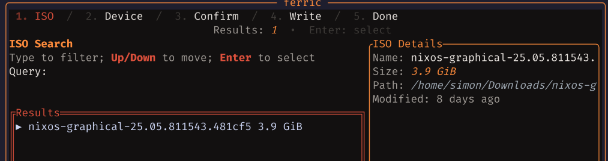

<div align="center">

<pre>
[Fe] ferric — small, safe(ish) ISO writer
</pre>

<br/>

<a href="https://github.com/irlnuisance/ferric-tui/actions/workflows/ci.yml">
  
  </a>
<a href="https://github.com/irlnuisance/ferric-tui/releases/latest">
  
  </a>
<a href="https://github.com/irlnuisance/ferric-tui/releases">
  
  </a>
<a href="https://www.rust-lang.org/">
  
  </a>
<a href="./LICENSE">
  
  </a>
<a href="#">
  
  </a>
<a href="https://ratatui.rs/">
  
  </a>
<a href="https://tokio.rs/">
  
  </a>
<a href="#">
  
  </a>

</div>



## Why

TEA-style state machine, strong types, no side-effects in the view. Feels like OCaml/Elm, written in Rust. Still figuring things out. Use at your own risk.

## Quick Start

```bash
cargo build --release
sudo -E ./target/release/ferric   # needs root to write
```

- Linux only (uses `lsblk`). Needs a real TTY. I rate Ghostty.
- No TTY? `script -q -c "./target/release/ferric" /dev/null`
- Nix: `nix develop` then the two lines above.

## What it does

- Live ISO search across `$PWD`, `~/Downloads`, `~` (substring)
- Safe device list via `lsblk -P` (drops loop/ro/root; mounted shown, marked)
- Confirm screen that demands you type `YES`
- Chunked write with bytes/%/speed/ETA; best-effort unmount + partprobe
- Optional verify (byte-compare); toggle with `v`
- Not root? hint + Ctrl-S re-exec under sudo

## Keys

- Global: `q`/`Ctrl-C` quit, `Esc` back, `Tab`/`Shift-Tab` cycle
- ISO: type to filter, `↑/↓` move, `Enter` select
- Devices: `↑/↓` move, `r` refresh, `Enter` select
- Confirm: type `YES`, `Enter` to go

## Safety

- Never picks a target by default; you must select
- Excludes obvious foot‑guns (loop, ro, root disk). Still: check the path
- Writing is destructive. Read that twice

## Status

Working: search, devices, confirm, write, optional verify. Smooth TUI. Fast enough, getting faster (I obsess).

Next: CLI flags/headless, cancel, `doas`/`pkexec` fallback, richer device details

## How it’s built

- TEA: Model + Msg + pure update -> Cmd — effects-as-data, no hidden state, tests boring.
- Std-first: my walkers/parsers; no serde/walkdir by default
- Strong types: `IsoPath`, `DevicePath`, `ByteSize`, `Percent`, `Throughput`

MIT — see `LICENSE`.

— simon
